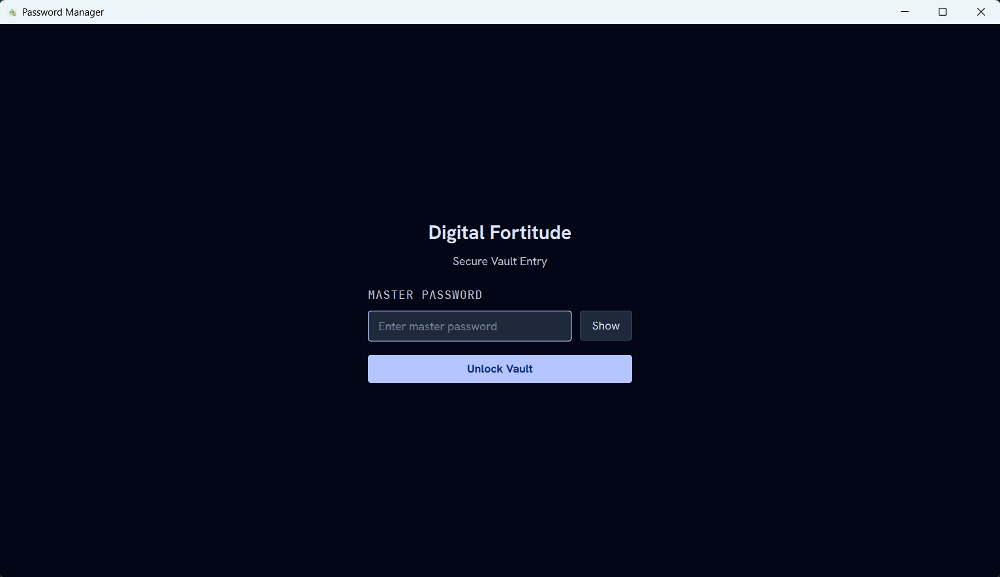

# Password Manager

A standalone, offline password manager for Windows. Stores logins, API keys,
secure notes, web/app addresses, and screenshots in one locally-encrypted
SQLite (SQLCipher) database, unlocked with a master password.

Built with **C++20 · Qt 6 Widgets · SQLCipher · libsodium**, using **CMake +
vcpkg** in **VS Code**.



📋 Design docs live in [`docs/`](docs/README.md) — start with
[`docs/PLAN.md`](docs/PLAN.md) and [`docs/DATA-MODEL.md`](docs/DATA-MODEL.md).

---

## Prerequisites (one-time setup)

1. **Visual Studio 2022** (or **Build Tools for VS 2022**) with the
   **"Desktop development with C++"** workload — provides the MSVC compiler,
   Windows SDK, and CMake.
2. **vcpkg** — clone, bootstrap, and set the `VCPKG_ROOT` environment variable:
   ```powershell
   git clone https://github.com/microsoft/vcpkg "$HOME\vcpkg"
   & "$HOME\vcpkg\bootstrap-vcpkg.bat"
   [Environment]::SetEnvironmentVariable("VCPKG_ROOT", "$HOME\vcpkg", "User")
   ```
3. **Qt 6** — install via the official Qt Online Installer (component:
   *Qt 6.x → MSVC 2022 64-bit*), then point `QT_DIR` at it:
   ```powershell
   # adjust the version/path to what you installed
   [Environment]::SetEnvironmentVariable("QT_DIR", "C:\Qt\6.8.0\msvc2022_64", "User")
   ```
   > Alternative: add `"qtbase"` to `vcpkg.json` to build Qt from source via
   > vcpkg instead (reproducible, but the first build is long).
4. **VS Code extensions:** *CMake Tools*, *C/C++* (you'll be prompted — they're
   in `.vscode/extensions.json`).

> Restart the terminal/VS Code after setting environment variables.

---

## Build & run

### From the command line
```powershell
cmake --preset default                      # configure (first run builds vcpkg deps)
cmake --build build --config Debug          # build
.\build\Debug\password_manager.exe          # run
```

### From VS Code
1. Open this folder. When prompted, select the **"default"** CMake preset.
2. Press **F5** to build and debug (or run the *CMake: build (Debug)* task).

> **First configure is slow:** vcpkg builds `sqlcipher` (pulls in OpenSSL) and
> `libsodium` from source. To skip that until you need them (M1/M2), temporarily
> trim `vcpkg.json` to `[]` dependencies.

---

## Project layout

```
password_manager/
├─ CMakeLists.txt        # build definition
├─ CMakePresets.json     # MSVC x64 + vcpkg toolchain preset
├─ vcpkg.json            # dependency manifest
├─ src/
│  ├─ main.cpp
│  ├─ app/               # Qt UI (MainWindow today; grows in M4)
│  └─ core/              # crypto / vault / storage / model (M1–M3)
├─ docs/                 # design docs
└─ .vscode/              # build/debug config
```

## Status

**M0 — Scaffold.** Buildable Qt placeholder window + tooling. See the roadmap in
[`docs/PLAN.md`](docs/PLAN.md#8-roadmap-milestones).
